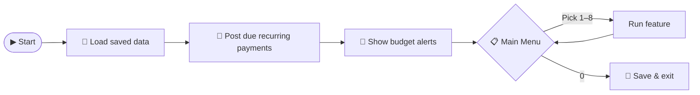
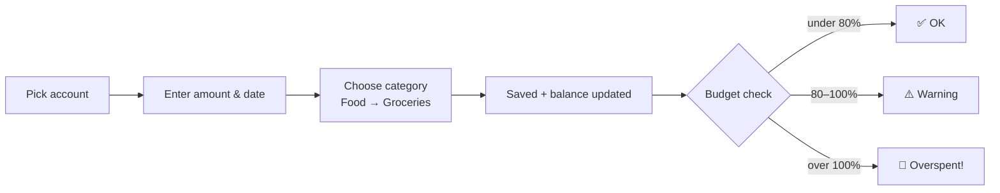

<div align="center">

# 💰 Personal Finance & Budget Manager

**Know where every rupee goes.**
A menu-driven C console app that tracks your money across accounts, catches overspending before it happens, and turns each month into a clear report.


*Programming Fundamentals semester project · BCS-1C · FAST-NUCES Karachi*

</div>

---

## 🧐 The Problem

Most people track money with spreadsheets, banking apps, or a notebook, and all three fall short:

- 📊 **Spreadsheets** need you to build every formula yourself and never warn you when you go over a budget.
- 🏦 **Banking apps** show one account at a time, with fixed categories and no savings goals.
- 📓 **Notebooks** can't search, add up totals, or compare one month with another.

So overspending is usually found out **after** the money is gone. Rent and subscriptions get typed in again every month, and nobody knows how close their savings goal really is.

## 💡 Our Solution

One program that manages **all your accounts in one place** and **analyses** your spending, not just records it:

> Log an expense → it's sorted into a category → the budget is checked right away → you get a warning **before** you overspend.

---

## ✨ Features

| | Feature | What it does |
|:-:|---|---|
| 🏦 | **Multiple accounts** | Cash, bank and savings, each with a running balance and a total net worth |
| 🧾 | **Smart transaction log** | Income and expenses in a list that grows as needed (no fixed limit) |
| 🌳 | **Category tree** | Categories inside categories, e.g. **Food → Groceries / Dining Out**, browsed level by level |
| 🎯 | **Monthly budgets** | Set a limit per category and see how much of it is used |
| 🚨 | **Overspend alerts** | ⚠️ Warning at 80% used · 🔴 Alert once the limit is crossed |
| 📅 | **Spending grid** | Month × category table showing where your money went all year |
| 🔁 | **Recurring payments** | Rent and subscriptions added automatically every month |
| 🐷 | **Savings goals** | Progress bars toward targets like *"Laptop – 150,000"* |
| 🔍 | **Search & filter** | Find transactions by date range, category, amount or keyword |
| 📄 | **Monthly reports** | Summary with month-to-month comparison, saved to a text file |
| 💾 | **Saved automatically** | Everything is written to files, so your data is still there next time |

---

## 🔄 How It Works



**Adding an expense, step by step:**



---

## 🖥️ Sneak Peek

```
=========== PERSONAL FINANCE MANAGER ===========
 [Auto-posted] Rent  -25,000  -> HBL Bank  (01/10/2026)
 [!] Dining Out: 112% of budget used this month
------------------------------------------------
 1. Accounts        5. Savings Goals
 2. Transactions    6. Search & Filter
 3. Categories      7. Recurring
 4. Budgets         8. Reports
 0. Save & Exit
Enter choice: _
```

```
BUDGET STATUS - October 2026
Category      Spent    Limit    Used
Food          8,500   10,000   [########--]  85%  WARNING
  Groceries   5,200
  Dining Out  3,300    3,000   [##########] 110%  OVERSPENT
Transport     2,100    4,000   [#####-----]  52%
```

```
SAVINGS GOALS
Laptop     [#########-----------]  45%   67,500 / 150,000
Emergency  [##############------]  70%   35,000 /  50,000
```

*(Sample screens show the planned final version.)*

---

## 🧠 C Concepts Used

| Concept | Where it's used |
|---|---|
| 🔀 **Switch & loops** | Menu-driven interface with nested sub-menus |
| 📦 **Arrays & 2D arrays** | Budget limits, month × category spending table |
| 🧩 **Functions & pointers** | Modular code, balances updated by reference |
| 🔤 **String functions** | Searching by keyword, category names (`strstr`, `strcmp`) |
| 🔁 **Recursion** | Walking and printing the category tree |
| 🏗️ **Structures** | Accounts, transactions, dates, categories, goals |
| 🧠 **Dynamic memory** | Transaction list that grows (`realloc`), 2D spending grid (`double **`) |
| 💾 **File handling** | Saving/loading all data, exporting monthly reports |

---

## 🚀 Getting Started

**You need:** a C compiler (GCC / MinGW) and a terminal.

```bash
# clone the repo
git clone https://github.com/syedmoaz14/Personal-Finance-Budget-Manager.git
cd Personal-Finance-Budget-Manager

# build
gcc -Wall *.c -o finance

# run
./finance        # Linux
finance.exe      # Windows
```

---

## 👥 Team

| Member | Roll No. | Responsibilities |
|---|---|---|
| **Syed Moaz Ali** | 26K-0630 | ⚙️ Core engine: main program, accounts & transactions, category tree, spending grid, recurring payments, search |
| **Syeda Maryam Fatima** | 26K-0618 | 🎨 Features & interface: menus, input validation, budgets & alerts, savings goals, reports |

---

## 📚 Documentation

- 📘 [Project overview & flowcharts](docs/OVERVIEW.md)
- 🗺️ [Design & work plan](docs/PLAN.md)

<div align="center">

Made with ☕ and `printf` by Moaz & Maryam

</div>
