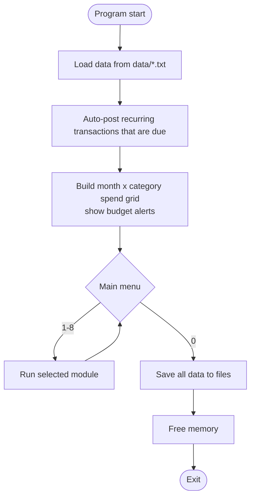
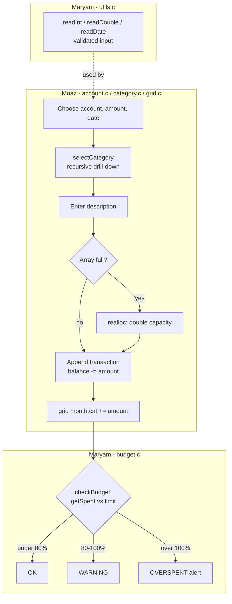
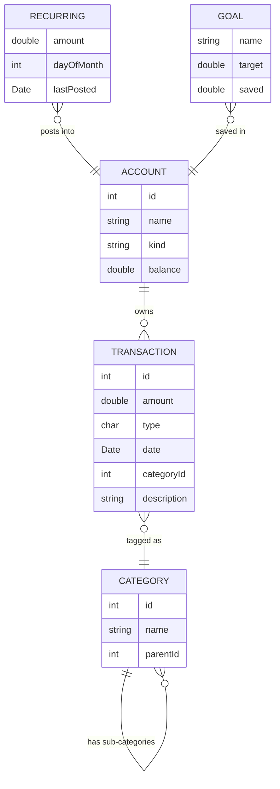

# Project Overview

**Personal Finance & Budget Manager** is a C console app that records every rupee coming in and going out across your accounts (cash, bank, savings). It sorts spending into categories, warns you when you go over a budget, posts rent and subscriptions automatically, tracks savings goals, and writes monthly reports.

## 1. Program lifecycle



## 2. Menu map

```
MAIN MENU
├── 1. Accounts ............. [Moaz]    add, view balances + net worth, transfer
├── 2. Transactions ......... [Moaz]    add income, add expense, history, delete
├── 3. Categories ........... [Moaz: tree + drill-down | Maryam: add, print tree]
├── 4. Budgets .............. [Maryam]  set limits, status, month x category table
├── 5. Savings Goals ........ [Maryam]  create goal, deposit, progress bars
├── 6. Search & Filter ...... [Moaz]    by date range, category, amount, keyword
├── 7. Recurring ............ [Moaz]    add/view/remove, auto-posts on startup
├── 8. Reports .............. [Maryam]  monthly summary, month vs month, export file
└── 0. Save & Exit .......... [shared]
```
Maryam also owns every sub-menu screen (`menus.c`) and input validation (`utils.c`).

## 3. Core flow: Add Expense



**Interface between the two halves:**
- `int selectCategory(void)` and `double getSpent(int month, int categoryId)`: Moaz provides them
- `void checkBudget(int month, int categoryId)`: Maryam provides it, Moaz calls it after every expense
- `void addToGoal(int goalIndex, double amount)`: Maryam provides it, Moaz calls it on tagged deposits
- `readInt`, `readDouble`, `readDate`: Maryam provides them, everyone uses them

## 4. Data model (final form, week 10+)



Budget data: `double **spendGrid` (12 months x categories, 2D DMA) and `double *budgetLimit` (one per category).

## 5. Data files

| File | Owner |
|---|---|
| `data/accounts.txt`, `data/transactions.txt`, `data/categories.txt`, `data/recurring.txt` | Moaz |
| `data/budgets.txt`, `data/goals.txt` | Maryam |
| `report_YYYY_MM.txt` (generated) | Maryam |

## 6. Sample screens

```
=========== PERSONAL FINANCE MANAGER ===========
 [Auto-posted] Rent  -25,000  -> HBL Bank  (01/10/2026)
 [!] Dining Out: 112% of budget used this month
------------------------------------------------
 1. Accounts        5. Savings Goals
 2. Transactions    6. Search & Filter
 3. Categories      7. Recurring
 4. Budgets         8. Reports
 0. Save & Exit
Enter choice: _
```

```
BUDGET STATUS - October 2026
Category      Spent    Limit    Used
Food          8,500   10,000   [########--]  85%  WARNING
  Groceries   5,200
  Dining Out  3,300    3,000   [##########] 110%  OVERSPENT
Transport     2,100    4,000   [#####-----]  52%
Rent         25,000   25,000   [##########] 100%
```

```
SAVINGS GOALS
Laptop     [#########-----------]  45%   67,500 / 150,000
Emergency  [##############------]  70%   35,000 /  50,000
```

See [PLAN.md](PLAN.md) for the weekly roadmap and responsibility split.
